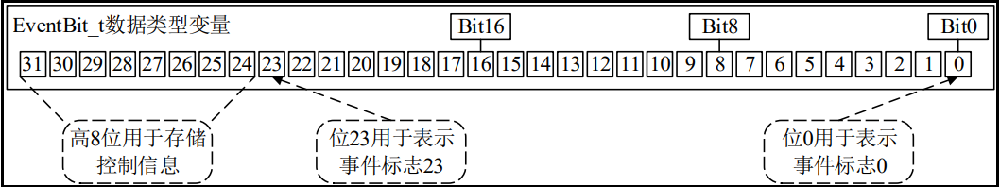

### 事件标志组使用场景
    事件标志组与信号量一样属于任务间同步的机制，但是信号量一般用于任务间的单事件同步，对于任务间的多事件同步，仅使用信号量就显得力不从心了。FreeRTOS 提供的事件标志组可以很好的处理多事件情况下的任务同步。本章就来学习FreeRTOS中事件标志组的相关内容    

    
### 事件组数据类型
    事件组是一组事件标志的集合，一个事件组就包含了一个 EventBites_t 数据类型的变量，变量类型 EventBits_t 的定义如下所示
    



### 事件组API
```c
// 使用动态方式创建事件标志组
xEventGroupCreate() 
// 使用静态方式创建事件标志组
xEventGroupCreateStstic() 

/**
    xEvenrGroup 等待的事件标志组
    uxBitsToWaitFor 等待的事件标志位，可以用逻辑或等待多个事件标志位
    xClearOnExit 成功等待到事件标志位后，清除事件组中对应的事件标志位
    xWaitForAllBits 等待 uxBitsToWaitFor 中的所有事件标志位（逻辑与）
    xTicksToWait 获取等待的阻塞时间
*/
// 等待事件标志位
xEventGroupWaitBits() 
// 设置事件标志位
xEventGroupSetBits() 
// 设置事件标志位，并等待事件标志位
// 清零事件标志位
xEventGroupClearBits() 
xEventGroupSync() 
// 在中断中设置事件标志位
xEventGroupSetBitsFromISR() 
// 在中断中清零事件标志位
xEventGroupClearBitsFromISR() 
// 获取事件组中各事件标志位的值
xEventGroupGetBits() 
// 在中断中获取事件组中各事件标志位的值
xEventGroupGetBitsFromISR() 
// 删除事件标志组
vEventGroupDelete() 

```